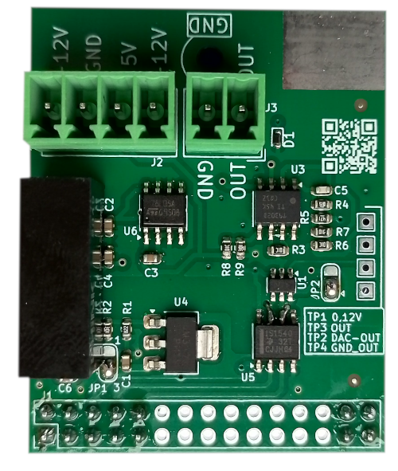
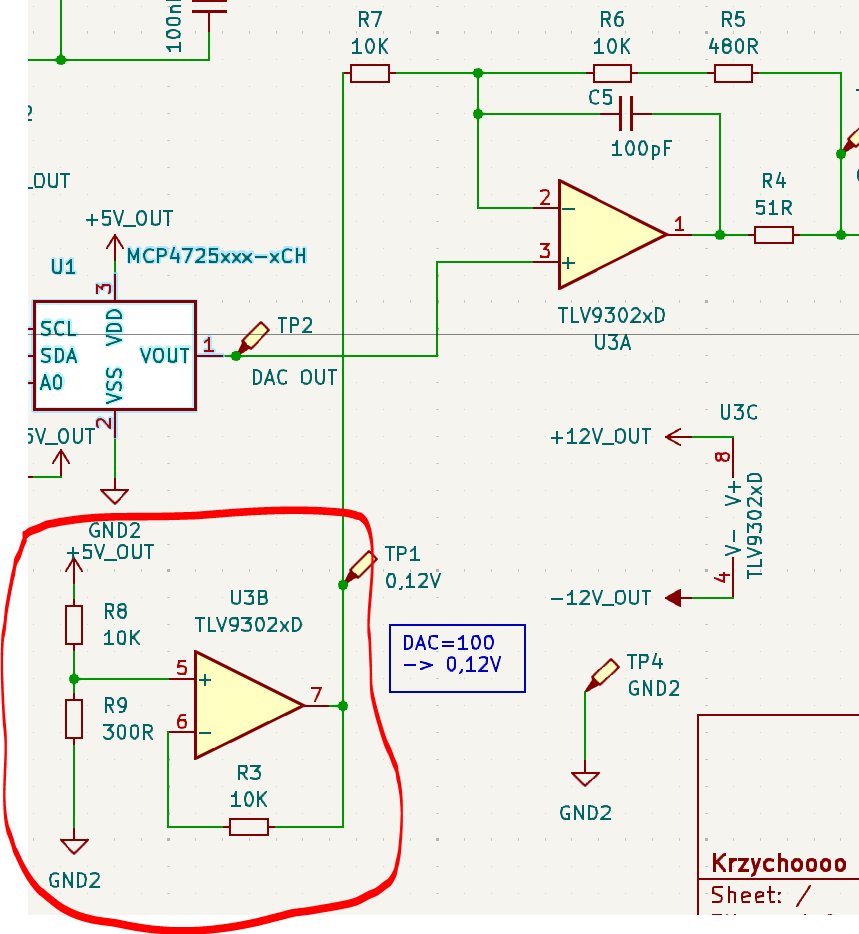
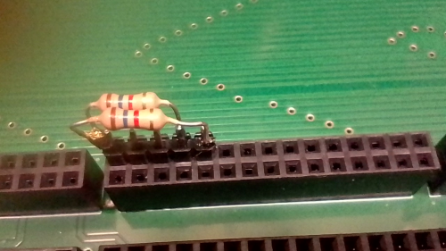

# Mercury_PCB_UOut1-10V_V100
<picture></picture>

The module allows you to set the output voltage in the range from 0V to 10V.
I used the DAC MCP4725 to implement this function.
The MCP4725 has a 12-bit resolution.
The MCP4725 has a voltage range from 0V to VCC.
In this project, VCC = 5V.
The module is controlled via the I2C bus.
The module address can be set to:
* 0x60 JP2 2-3
* 0x61 JP2 1-2

The module is galvanically isolated from the processor.   
The output circuit is powered by a 12V to +/-12V DC/DC converter.   
The I2C signals are separated by an ISO1540 circuit.
To achieve an output range of 0 - 10V, I used the TLV9302 amplifier.

According to the datasheet, the converter works very accurately, but not for codes from 000h to FFFh.
Codes in the range 100 to 4000 guarantee very low error.

The voltage for code 100 is:

U100 = 100 * 5V/4096 = 120mV

I used a trick.   
The U3A amplifier amplifies the voltage relative to 120mV, not GND.
<picture></picture>

Don't forget to pull up the SDA and SCL signals on the master side to 3.3V.   
You can choose pull-up resistors from 1K to 10K.   
Connections:   
SDA -> IO21   
SCL -> IO22   
I implemented it like this:   
<picture></picture>  
You can do this on any slot.

## Links:   

#### Hardware:   
1. <a href="https://github.com/krzychoooo/Mercury_PCB_Ethernet_V100" target="_blank">Mercury_PCB_Ethernet_V100</a>
2. <a href="https://github.com/krzychoooo/Mercury_PCB_NPNOUT_x8_V100" target="_blank">Mercury_PCB_NPNOUT_x8_V100</a>
3. <a href="https://github.com/krzychoooo/Mercury_PCB_Relay3x_V100" target="_blank">Mercury_PCB_Relay3x_V100</a>
4. <a href="https://github.com/krzychoooo/Mercury_PCB_UOut1-10V_V100" target="_blank">Mercury_PCB_UOut1-10V_V100</a>   
5. <a href="https://github.com/krzychoooo/Mercury_PCB_Inputx5_V100" target="_blank">Mercury_PCB_Inputx5_V100</a>   
6. <a href="https://github.com/krzychoooo/MercuryBase_4slot" target="_blank">MercuryBase_4slot</a>

#### Soft:   
1. <a href="https://github.com/krzychoooo/Mercury_Soft_UOut1-10V_V100" target="_blank">Mercury_Soft_UOut1-10V_V100</a>
2. <a href="https://github.com/krzychoooo/Mercury_Soft_RS485_V100" target="_blank">Mercury_Soft_RS485_V100</a>
3. <a href="https://github.com/krzychoooo/Mercury_Soft_Relay_x3_V100" target="_blank">Mercury_Soft_Relay_x3_V100</a>
4. <a href="https://github.com/krzychoooo/Mercury_Soft_Input5x_V1.0.0" target="_blank">Mercury_Soft_Input5x_V1.0.0</a>   

#### Outside:
* <a href="https://tranzystorek.pl/" target="_blank">https://tranzystorek.pl/</a>
* <a href="https://krzychopcb.pl/" target="_blank">PCB assembly</a>   